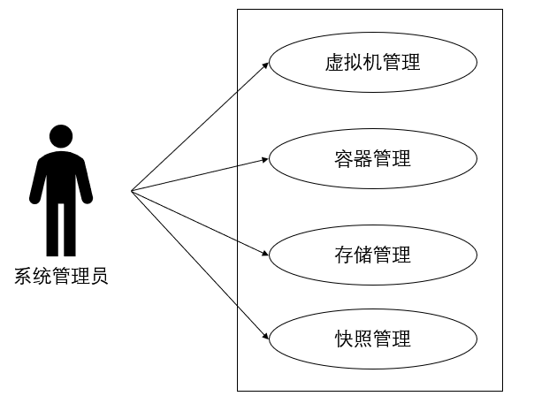
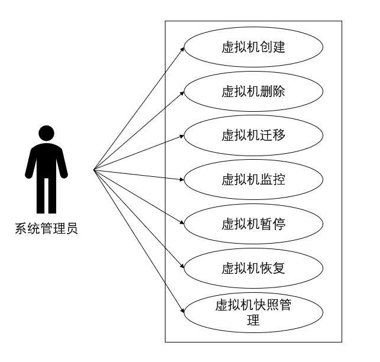
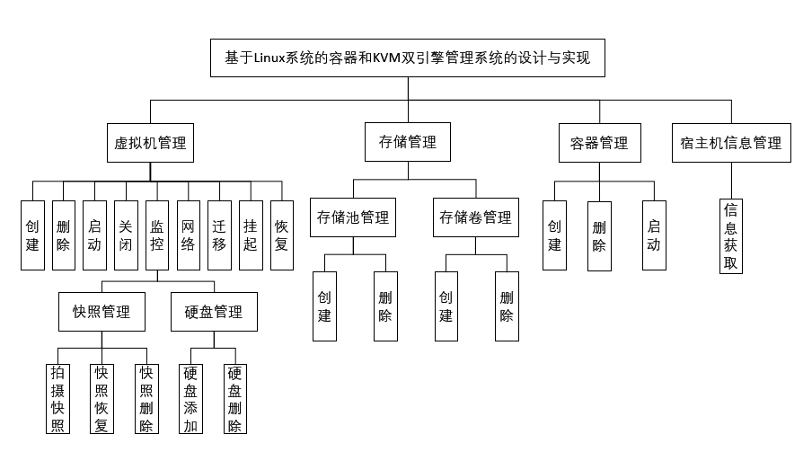
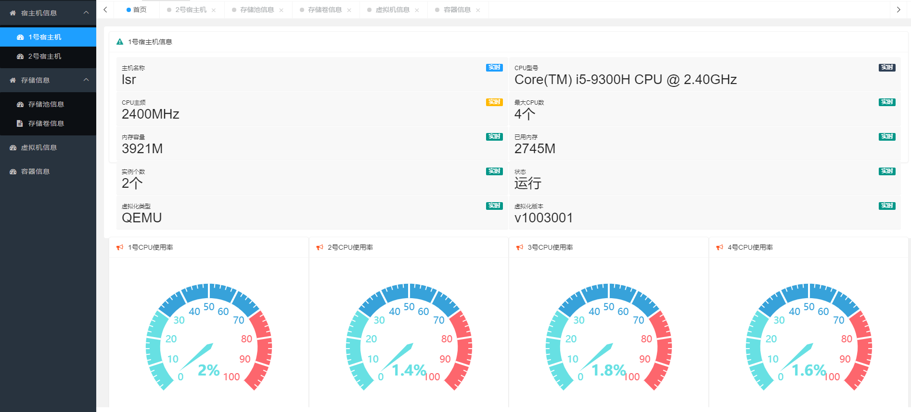

《KVM虚拟化实践与编程》课程设计任务书

2025/2026学年第2学期

班级：2024级计算机与软件学院软件工程专业云计算方向

**考核题目：云平台管理系统**

**题目描述：**

基于开源libvirt API设计并实现一套可视化云平台管理系统，依托 KVM
虚拟化技术完成虚拟机全生命周期管控、镜像资源管理、宿主机状态监控等核心功能。系统禁止直接调用
virsh 命令，全部功能通过原生 libvirt API
编码实现。系统配备图形化交互界面，支持镜像资源复用、多台虚拟机集中管控，降低
KVM 虚拟化操作门槛，模拟中小型私有云平台运维场景。

**题目设计目标：**

1)  深入理解虚拟化基础原理、KVM 架构与 libvirt 工作机制，熟练掌握
    libvirt 各类 API 的调用方法。

2)  掌握 Linux
    平台下应用程序开发、虚拟化资源调度逻辑，具备虚拟化平台程序开发与调试能力。

3)  掌握图形化界面开发、资源管理、多实例并发管理、镜像模板复用等工程化开发技能，提升综合代码实现与系统设计能力。

4)  理解虚拟机调度、快照、网络、存储等虚拟化核心模块的工作原理，完成完整的云管理功能落地。

**题目内容与功能要求：**

本系统面向系统管理员角色，基于 libvirt API
开发，搭配图形化操作界面，完整实现宿主机、虚拟机、镜像、网络、快照、存储等模块管理，具体功能要求如下：

**一、基础通用要求**

- 开发规范：严禁通过代码调用 virsh
  命令执行虚拟化操作，所有虚拟化功能必须基于 libvirt 原生 API 编码实现。

- 交互要求：系统需开发友好易用的图形化界面，所有业务操作、信息查看均通过图形界面完成，替代传统命令行操作。

  **二、核心功能模块要求**

  **（1）宿主机信息管理**

  获取本地及远程宿主机硬件与运行状态信息，包括主机名称、CPU
  型号、主频、核数、内存总容量、已用内存、虚拟化类型、虚拟化版本等；实现
  CPU、内存等运行数据可视化展示。

  **（2）镜像资源管理**

  实现系统镜像的统一管理，支持镜像资源复用：

  支持镜像添加、删除操作，界面展示全部已录入镜像列表；

  已添加的镜像可作为模板重复使用，为新建虚拟机提供镜像来源，实现镜像复用。

  **（3）虚拟机管理**

  支持单台虚拟机创建与多台虚拟机集中管理，完整覆盖虚拟机全生命周期操作：

  虚拟机新建：通过图形界面配置虚拟机名称、CPU、内存、磁盘、网络等参数，并可从已添加的镜像库中选择镜像，完成全新
  KVM 虚拟机创建；

  多虚拟机统一管理：程序可自动识别宿主机上所有虚拟机实例，在图形界面以列表形式集中展示，支持对多台虚拟机独立管控；

  基础生命周期操作：对任意虚拟机执行启动、暂停、恢复、删除操作；

  网络管理：支持对指定虚拟机进行网络连接、网络断开、网络模式配置。

  **（4）虚拟机快照管理**

  实现虚拟机快照全套功能：拍摄虚拟机快照、基于快照恢复虚拟机状态、删除无用快照。

  **（5）选做功能**

  存储池、存储卷的创建、删除、查询与分配管理；

  虚拟机冷迁移、热迁移功能实现。

课程设计报告内容及规范

> 课程设计报告要求，包括如下几个部分：

1.  虚拟化环境搭建：详细书写 KVM+libvirt
    环境搭建完整步骤，附上关键操作截图，可复用课内实验相关截图。

2.  需求分析：明确系统整体需求、功能细分需求，绘制系统管理员整体用例图、虚拟机管理等子用例图，并搭配文字说明。例如：

本系统只有一种用户角色：系统管理员。系统管理员用例图如图3–1所示。

 

图3–1 系统管理员用例图

（1）系统管理员管理虚拟机用例图如图3–2所示。

图3–2 系统管理员管理虚拟机用例图

3.  系统设计：绘制系统整体功能模块图、各核心功能业务流程图，梳理系统架构、数据结构、函数调用逻辑。

图4–3主要功能模块图

4.  系统实现：说明开发环境、程序运行方式；讲解代码中关键数据结构、各功能子函数逻辑；附上核心代码、程序运行全流程截图（含图形界面、镜像管理、虚拟机新建、多虚拟机列表等界面截图）

    4.1宿主机信息获取功能实现

> 在本系统中宿主机的信息至关重要，因为本系统所管理的对象如虚拟机、容器皆是依赖于宿主机存在的，一旦宿主机宕掉，在该宿主机上的所有对象都将无法启动，因此对宿主机的监控是非常有必要的。在本系统中获取宿主机的信息使用的是Hyperic-Sigar工具集，但由于该工具集只能获取本地宿主机信息，因此需要使用远程调用方法来获取其他宿主机的信息。通过在本地调用Hyperic-Sigar的接口方法可以获取本地宿主机的所有硬件信息。宿主机信息展示如图5–4所示。

图5–4 宿主机信息展示

> 在本系统中，因系统功能要求需要宿主机的硬件运行信息而Hyperic-Sigar工具集又只能对本地宿主机的信息进行收集，因此需要使用Java的远程调用方法实现远程获取宿主机的硬件运行信息。远程调用代码如下：
>
> try {
>
> ServerInfo serverInfo = new
> ServerInfoImpl();
>
> LocateRegistry.createRegistry(8888);
>
> Naming.bind("rmi://192.168.10.102:8888/ServerInfo",serverInfo);
>
> System.out.println("\>\>\>\>\>INFO:远程IHello对象绑定成功！");//代码注释
>
> } catch (RemoteException e) {
>
> System.out.println("创建远程对象发生异常！");
>
> e.printStackTrace();
>
> } catch (AlreadyBoundException e) {
>
> System.out.println("发生重复绑定对象异常！");
>
> e.printStackTrace();

5.  小组分工：明确每位组员负责的功能模块、文档编写等工作内容。

**考核规则：**

1)  本课程设计以小组形式完成，每组 2~3
    人；严禁抄袭，抄袭者整组总成绩记零分。

2)  未按规定提交课程设计报告，整组总成绩记零分。

3)  源代码无法正常编译、运行，功能未达到题目要求，整组总成绩记零分。

4)  未使用 libvirt API、违规调用 virsh 命令实现功能，按不合格处理。

**上交内容：**

每组提交电子版资料，包含课程设计报告+完整源代码压缩包+程序使用说明（可选）。
