南 阳 理 工 学 院

《KVM虚拟化实践与编程课程设计》报告

# 云平台管理系统

|      |      |      |
|------|------|------|
| 姓名 | 学号 | 成绩 |
|      |      |      |

> 专业： 软件工程
>
> 班级： 24云计算1班
>
> 指导教师： 单平平

南阳理工学院计算机与软件学院

2026年06月

---

# 1 虚拟化环境的搭建

## 1.1 课题研究背景

　　虚拟化技术可以把一台物理主机划分为多台相互隔离的虚拟机。它常用于教学实验、私有云平台和服务器资源整合。KVM 是 Linux 内核提供的虚拟化方案，libvirt 提供统一的管理接口，可以管理虚拟机、网络、存储池和快照。

　　传统管理方式主要依赖命令行。命令行适合运维人员调试，但不适合展示资源状态，也不利于初学者理解虚拟机生命周期。本课题设计一个云平台管理系统，通过图形界面调用后端 REST API，实现宿主机信息查看、虚拟机管理、网络管理、存储管理和快照管理。

　　本系统的开发分为两个阶段。Windows 阶段使用 mock 数据完成前后端联调。CentOS 阶段使用 libvirt 连接真实 KVM 环境。这样既能降低本地开发成本，也能保证最终功能可以在真实虚拟化环境中运行。

## 1.2 CentOS Stream 10 环境

　　后端真实部署环境为 CentOS Stream 10。该系统运行在 VMware 虚拟机中，并已开启嵌套虚拟化。部署拓扑如图1-1所示。

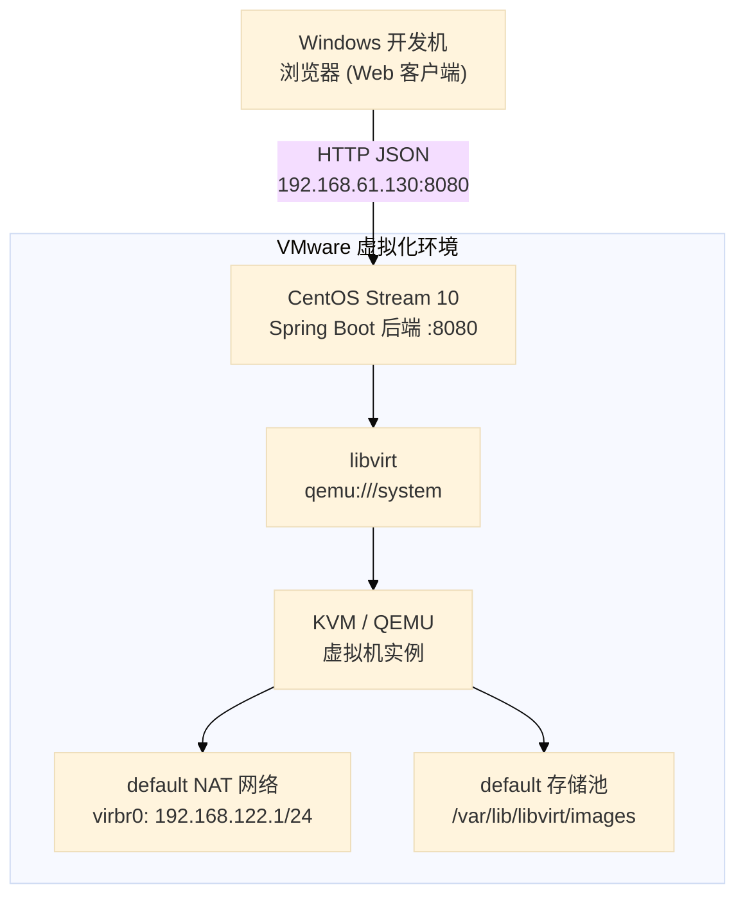
```mermaid
%%{init: {"theme": "base"}}%%
flowchart TB
    Windows["Windows 开发机<br/>浏览器 (Web 客户端)"]

    subgraph VMHost["VMware 虚拟化环境"]
        CentOS["CentOS Stream 10<br/>Spring Boot 后端 :8080"]
        Libvirt["libvirt<br/>qemu:///system"]
        KVM["KVM / QEMU<br/>虚拟机实例"]
        Network["default NAT 网络<br/>virbr0: 192.168.122.1/24"]
        Storage["default 存储池<br/>/var/lib/libvirt/images"]
    end

    Windows -->|HTTP JSON<br/>192.168.61.130:8080| CentOS
    CentOS --> Libvirt
    Libvirt --> KVM
    KVM --> Network
    KVM --> Storage
```

图1-1 KVM 云平台部署拓扑图

　　本部署拓扑图清晰界定了Windows开发联调期（通过策略模式注入的假数据）与CentOS真实物理运行期（直接通过动态加载库与宿主机套接字交互）的物理隔离，旨在以低成本的单机环境换取高稳定性的底层联调。

　　该环境使用 OpenJDK 21 运行后端服务，libvirt 连接地址为 `qemu:///system`，动态库路径为 `/usr/lib64/libvirt.so.0`。默认虚拟网络为 `default`，默认存储池也为 `default`。

## 1.3 虚拟化能力检查

　　在 CentOS 中通过以下命令检查虚拟化能力：

```bash
grep -E 'vmx|svm' /proc/cpuinfo
lsmod | grep kvm
ls -la /dev/kvm
cat /sys/module/kvm_amd/parameters/nested
```

　　检测结果显示，CPU 包含 `svm` 标志，`kvm_amd` 模块已加载，`/dev/kvm` 设备存在，嵌套虚拟化参数为 `1`。这说明该环境可以运行 KVM 虚拟机。

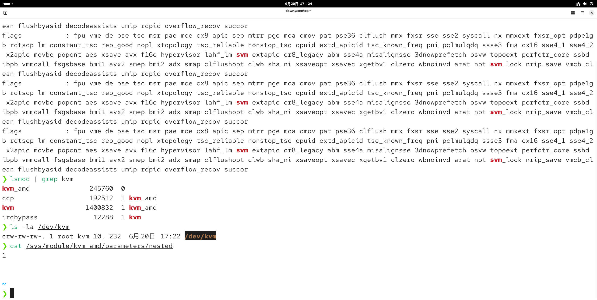

　　CentOS Stream 10 使用模块化 libvirt 服务。QEMU 相关服务为 `virtqemud`，不是传统的 `libvirtd`。因此，`libvirtd` 显示 inactive 并不表示 libvirt 不可用。实际连接使用：

```bash
virsh -c qemu:///system list --all
```

　　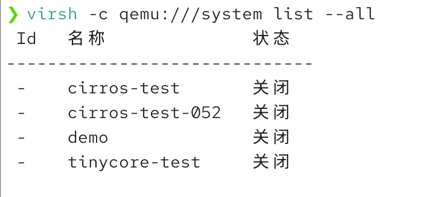

## 1.4 网络与防火墙配置

　　为保证 Windows 客户端或浏览器能够正常访问 CentOS 后端服务，需确保 8080 端口已开放。在 CentOS 部署服务器上，可以通过查询防火墙规则以及端口监听状态进行验证：

```bash
firewall-cmd --list-ports
ss -tlnp | grep 8080
```

　　此外，默认虚拟网络为 `default`，其转发模式为 NAT，对应宿主机侧的虚拟网桥为 `virbr0`，网段为 `192.168.122.1/24`。可通过以下命令查看虚拟网络状态与网桥配置：

```bash
virsh net-list --all
ip addr show virbr0
```

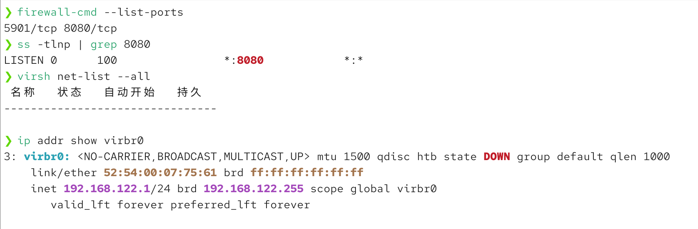

---

# 2 需求分析

## 2.1 系统功能需求

　　本系统面向虚拟化平台管理员，主要完成 KVM 资源的可视化管理。系统分为后端服务和前端客户端。后端负责连接 mock 数据或 libvirt；前端负责展示资源状态并发起管理操作。

　　主要功能包括：

1. 宿主机信息查看：展示主机名、CPU、内存、KVM 状态、libvirt 版本和 QEMU 版本。
2. 虚拟机管理：展示虚拟机列表，支持启动、关机、强制关闭、暂停、恢复、创建和删除。
3. 镜像管理：展示镜像文件，支持添加和删除镜像记录。
4. 网络管理：展示 libvirt 网络，支持启动和停止网络。
5. 快照管理：展示虚拟机快照，支持创建、恢复和删除快照。
6. 存储管理：展示存储池和存储卷信息。
7. 双模式运行：Windows 开发使用 mock profile，CentOS 部署使用 libvirt profile。

## 2.2 非功能需求

　　系统需要满足以下要求：

1. 后端使用 Spring Boot 提供 REST API。
2. 后端通过 Spring Profile 区分 `mock` 和 `libvirt`。
3. 模拟模式不加载 Linux 的 libvirt 动态库。
4. 前端只通过 HTTP 调用后端，不直接调用 libvirt。
5. 业务代码不使用 `virsh` 命令实现功能。
6. 页面操作应包含结果与超时提示。
7. 危险操作需要二次确认。

## 2.3 关机用例

　　虚拟机关机用例的前置条件是虚拟机处于运行或暂停状态。正常情况下，系统向虚拟机发送 ACPI 关机信号并等待状态变更；若等待超时，则引导管理员执行强制断电。

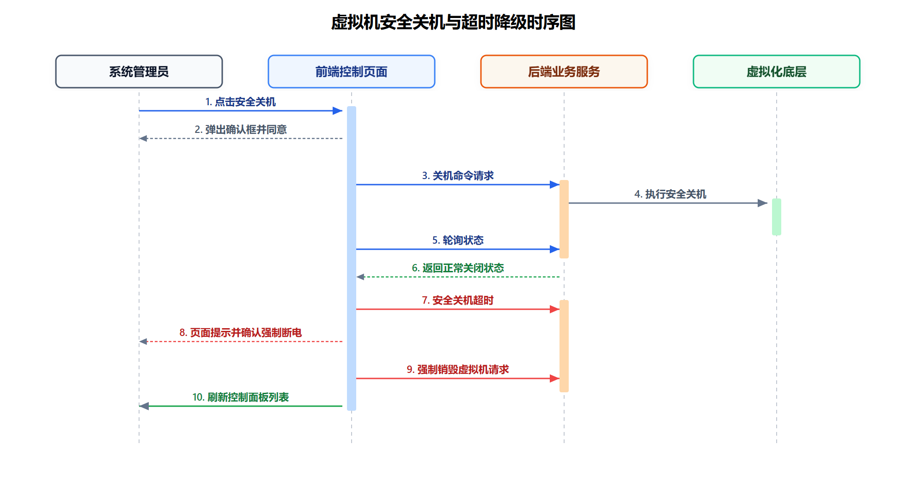

　　本时序图展示了虚拟机关机在异常状态下的自愈降级处理流程。当管理员发出关机指令后，系统通过前后台协同进行不间断的轻量轮询；一旦超过最大轮询阈值，系统即判定虚拟机系统出现崩溃或挂起，并自动开启强制关闭选项，从而在安全性与响应体验间取得平衡。

## 2.4 系统用例图

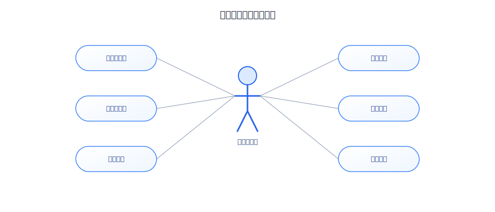

图2-1 系统管理员整体用例图

　　本用例图展示了系统管理员对于虚拟化资源管理所拥有的六大核心主用例。该用例划分明确了操作的权限范畴，并将这些细粒度的交互操作收拢在统一的管控界面中，大幅减小了系统管理员的手动维护开销。

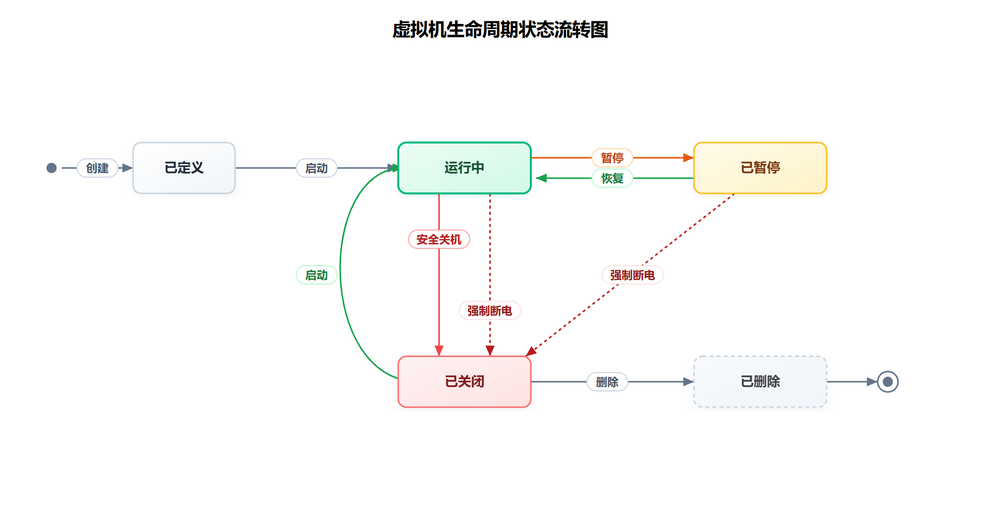

图2-2 虚拟机生命周期状态流转图

　　本生命周期流转图明确了虚拟机状态流转的约束规则。后端业务层严格遵照该状态机执行操作（如已暂停的虚拟机必须通过恢复操作方能再次触发关机），保证了由于状态非同步引起的数据污染或写操作冲突在边界上被有效拦截。

---

# 3 系统设计

## 3.1 总体架构

　　系统采用前后端分离结构。后端提供统一 REST API，前端为 Web 客户端。客户端不直接访问 libvirt。

　　系统总体部署架构如图3-1所示。

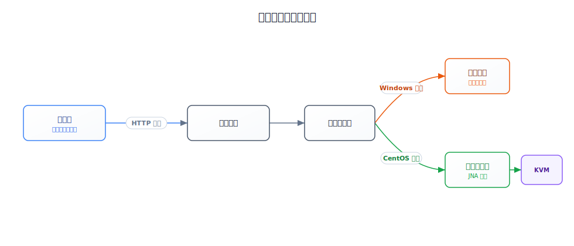

图3-1 系统总体部署架构

　　本部署架构体现了多层解耦设计。整个交互链路在垂直方向上从客户端依次穿过控制器层、业务服务层与动态加载代理，最终抵达虚拟化物理底层，保障了任意一层内部实现的演进均不会对其上下游造成破坏性影响。

## 3.2 模块设计

　　项目采用多模块结构：`common` 提供共享 DTO、请求对象与统一响应对象；`backend` 提供 REST API 和业务服务；`client-web` 提供 Web 端管理界面。

　　系统模块依赖如图3-2所示。该图只展示项目顶层模块之间的依赖关系，后端内部的双模式实现单独展开说明。

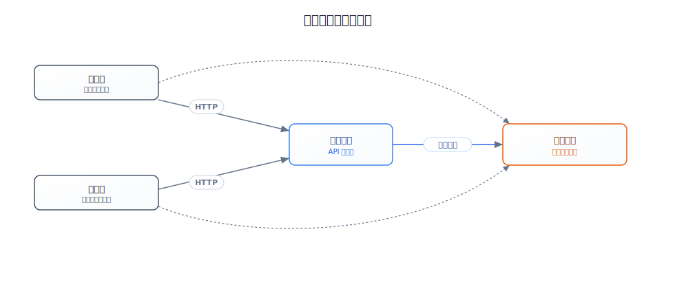

图3-2 项目模块依赖图

　　本依赖关系图突出了核心数据传输实体的共享契约作用。客户端与后端通过对通用模型模块的单向依赖，实现前后端数据结构同步，避免了跨进程通信中数据反序列化的契约冗余。

　　后端内部以 `controller` 接收 REST 请求，以 `service` 定义业务接口，并通过 `service.mock` 和 `service.libvirt` 提供两套实现；`exception` 包负责统一异常响应。

　　后端通过 Spring Profile 将 Windows 开发阶段的模拟数据实现与 CentOS 部署阶段的真实 libvirt 实现隔离，具体结构如图3-3所示。

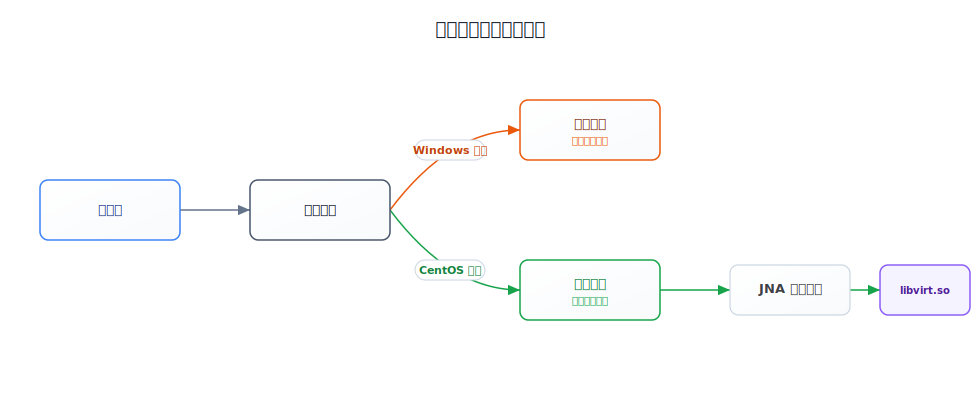

图3-3 后端双模式服务结构

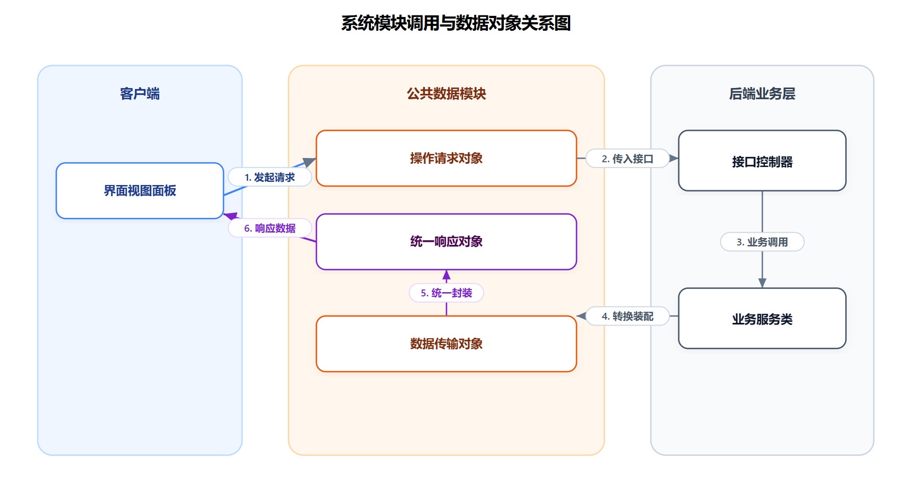

图3-4 数据对象关系图

　　本后端结构揭示了基于面向对象多态特征的动态装配机制。它通过声明统一的服务基类，利用特定的属性配置文件在系统启动阶段选择性地加载实体代理或虚设代理，做到了开发环境与物理部署环境的无缝过渡。

## 3.3 数据对象设计

　　前后端通过 JSON 交换数据。数据对象不直接暴露 libvirt 指针或底层结构，而是通过请求对象、资源 DTO 和统一响应对象完成封装。整体数据交换关系如图3-4所示。

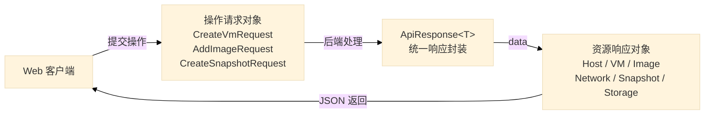
```mermaid
%%{init: {"theme": "base"}}%%
flowchart LR
    Client["Web 客户端"]
    Request["操作请求对象<br/>CreateVmRequest<br/>AddImageRequest<br/>CreateSnapshotRequest"]
    Api["ApiResponse&lt;T&gt;<br/>统一响应封装"]
    Response["资源响应对象<br/>Host / VM / Image<br/>Network / Snapshot / Storage"]

    Client -->|提交操作| Request
    Request -->|后端处理| Api
    Api -->|data| Response
    Response -->|JSON 返回| Client
```

图3-4 前后端数据对象关系

　　本数据关系图展示了网络边界上的实体封装逻辑。系统通过定义统一的通用返回结构、操作请求对象和数据传输对象，将真实的虚拟化句柄及细节安全地隔离在服务层内部，提高了通信协议的抗篡改能力。

　　所有接口统一返回 `ApiResponse<T>`：

```java
public class ApiResponse<T> {
    public boolean success;
    public String message;
    public T data;
}
```

　　宿主机与虚拟机是系统中最核心的两个资源对象，其主要字段关系如下：

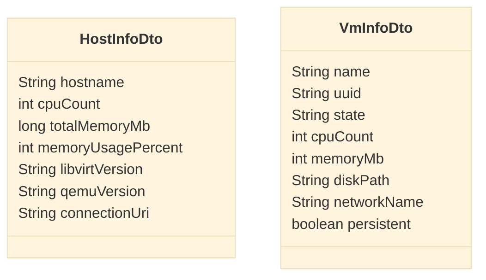
```mermaid
%%{init: {"theme": "base"}}%%
classDiagram
    class HostInfoDto {
        String hostname
        int cpuCount
        long totalMemoryMb
        int memoryUsagePercent
        String libvirtVersion
        String qemuVersion
        String connectionUri
    }

    class VmInfoDto {
        String name
        String uuid
        String state
        int cpuCount
        int memoryMb
        String diskPath
        String networkName
        boolean persistent
    }
```

---

# 4 系统实现

## 4.1 后端 Profile 隔离

　　后端通过 Spring Profile 区分开发模式和真实模式。mock 模式使用内存数据，不加载 libvirt。libvirt 模式才加载 `/usr/lib64/libvirt.so.0`。

```java
@Component
@Profile("libvirt")
public class LibvirtConnectionManager {
    private final String uri;
    private final LibvirtLibrary library;

    public LibvirtConnectionManager(
            @Value("${kvm.libvirt.uri}") String uri,
            @Value("${kvm.libvirt.library}") String libraryPath) {
        this.uri = uri;
        this.library = Native.load(libraryPath, LibvirtLibrary.class);
    }
}
```

　　该设计避免了 Windows 开发环境加载 Linux 动态库。

## 4.2 libvirt JNA 映射

　　后端使用 JNA 映射 libvirt C API。核心接口包括连接管理、虚拟机管理、网络管理、快照管理和存储管理。

```java
public interface LibvirtLibrary extends Library {
    Pointer virConnectOpen(String name);
    int virConnectClose(Pointer conn);
    int virConnectListAllDomains(Pointer conn, PointerByReference domains, int flags);

    Pointer virDomainLookupByName(Pointer conn, String name);
    int virDomainCreate(Pointer domain);
    int virDomainShutdown(Pointer domain);
    int virDomainDestroy(Pointer domain);
    int virDomainSuspend(Pointer domain);
    int virDomainResume(Pointer domain);
    int virDomainFree(Pointer domain);
}
```

　　系统不调用 `virsh` 命令，所有操作均通过 libvirt API 实现。

## 4.3 虚拟机生命周期实现

　　虚拟机操作集中在 `LibvirtVmService`。服务先打开 libvirt 连接，再根据名称查找 domain，最后调用对应的生命周期函数。

```java
@Override
public void startVm(String name) {
    withDomain(name, domain -> {
        check(manager.library().virDomainCreate(domain), "启动虚拟机失败：" + name);
        return null;
    });
}

@Override
public void shutdownVm(String name) {
    withDomain(name, domain -> {
        check(manager.library().virDomainShutdown(domain), "关闭虚拟机失败：" + name);
        return null;
    });
}

@Override
public void destroyVm(String name) {
    withDomain(name, domain -> {
        check(manager.library().virDomainDestroy(domain), "强制关闭虚拟机失败：" + name);
        return null;
    });
}
```

　　`shutdownVm` 发送关机信号。若虚拟机内部系统未响应，前端将进行状态轮询，并在超时后提示用户可选择强制断电。

## 4.4 Web 客户端实现

　　Web 客户端项目位于 `client-web` 目录，是管理员进行虚拟化管控的主要入口。前端采用了模块化架构，其技术选型和功能模块划分如下：

1. **核心技术选型与开发工具**：
   - 框架层使用 Vue 3 的组合式 API，配合 TypeScript 强类型支持。通过定义 `types/kvm.ts` 类型声明文件，将前端实体对象与后端的 DTO 保持高度类型一致，规避了数据反序列化时的字段解析错误。
   - 构建工具使用 Vite，通过快速的热重载极大提升了开发环境的反馈速度。在开发阶段，利用 `vite.config.ts` 中的 `server.proxy` 属性配置了反向代理，将以 `/api` 开头的请求安全地转发到位于 CentOS 虚拟机上的后端服务，屏蔽了浏览器跨域限制。

2. **多视图路由与多层布局**：
   - 路由层使用 Vue Router，配置了 7 个不同的页面路由，分别对应宿主机、虚拟机、镜像、存储池、虚拟网络和快照的视图管理。
   - 界面整体采用大地橙暖色调设计（主色 `#ca6a1f`，底色 `#f8f6f2`），采用两栏式侧边导航主布局。页面顶部集成了宿主机连接健康度的实时探针，底部挂载了滚动终端风格的全局操作日志面板。

3. **全局状态与日志追踪设计**：
   - 状态层采用 Pinia。系统中设计了两个 Store 模块，其中 `logStore` 用于在内存中缓存最近的 200 条用户操作日志。
   - 前端封装了通用的 Axios 拦截器。在每次向后端发出请求时，通过自定义的 `X-Action-Description` 消息头携带本次操作的中文描述。拦截器在捕获到后端的响应结果后，无论是成功还是失败，都会自动将此日志推送到 Pinia 状态库中，使底层的日志面板能实时、直观地反映当前所有的 KVM 资源调配状态。

4. **实时看板数据可视化**：
   - 使用 ECharts 库在控制面板主页绘制动态监控图表。系统接收到宿主机的资源占用响应后，由 Vue 响应式变量触发 ECharts 重新调用绘图接口，分别绘制物理内存占用占比环形图、虚拟机状态统计饼图以及 KVM 存储池配额分配堆叠图，实现了云端物理机及虚拟机指标的可视化呈现。

　　前端主要页面围绕宿主机、虚拟机、镜像、网络、快照和存储资源组织，页面结构如下：

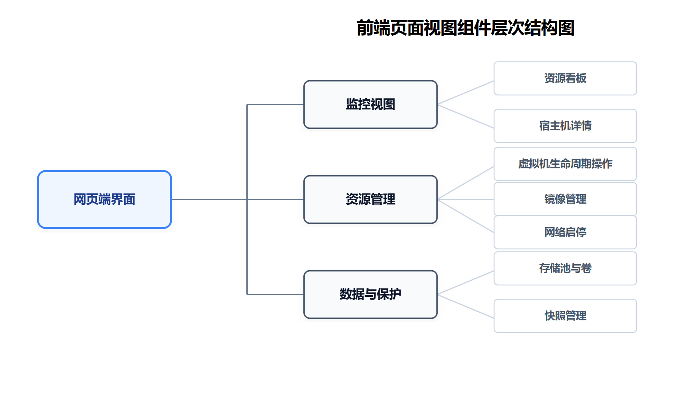

## 4.5 关机轮询与超时处理

　　虚拟机关机操作控制流如图4-1所示。

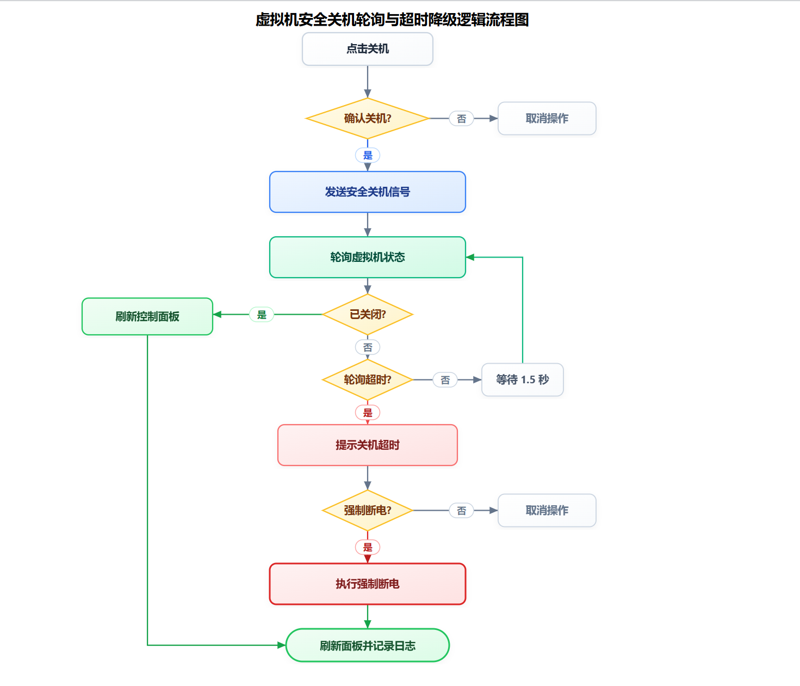

图4-1 虚拟机关机轮询与超时处理流程

　　本流程图描述了非阻塞的异步状态回收算法设计。前台通过定时器进行间隔查询以替换传统的后端长连接轮询，这不仅释放了后台处理线程，也通过前台超时判定提供了更加灵活的人机交互选择。

　　Web 前端在执行关机操作后，不直接认为虚拟机已经关闭，而是继续查询虚拟机状态。若状态变为“关闭”，则刷新列表。若超过等待次数仍未关闭，则显示强制关闭按钮。

```typescript
const startShutdownPoll = (name: string) => {
  let pollCount = 0
  const maxPoll = 15

  activePollInterval = setInterval(async () => {
    pollCount++
    const detail = await getVmDetail(name)

    if (detail.state === '关闭') {
      clearShutdownTimer()
      shutdownProgress.value = 100
      shutdownStatusText.value = '虚拟机已关闭'
      await fetchData()
    } else if (pollCount >= maxPoll) {
      clearShutdownTimer()
      shutdownProgressStatus.value = 'exception'
      shutdownStatusText.value = '虚拟机未在规定时间内关闭，可执行强制关闭'
      showForceShutdownBtn.value = true
    }
  }, 1500)
}
```

　　该逻辑能够反映虚拟机的实际运行状态。

---

# 5 系统测试与验证

## 5.1 本地构建测试

　　后端在 Windows 本地使用 JDK 21 构建：

```bash
mvn clean package -DskipTests
```

　　Web 前端在 `client-web` 目录下构建：

```bash
npm run build
```

　　构建通过后，前端资源输出到 `client-web/dist`。

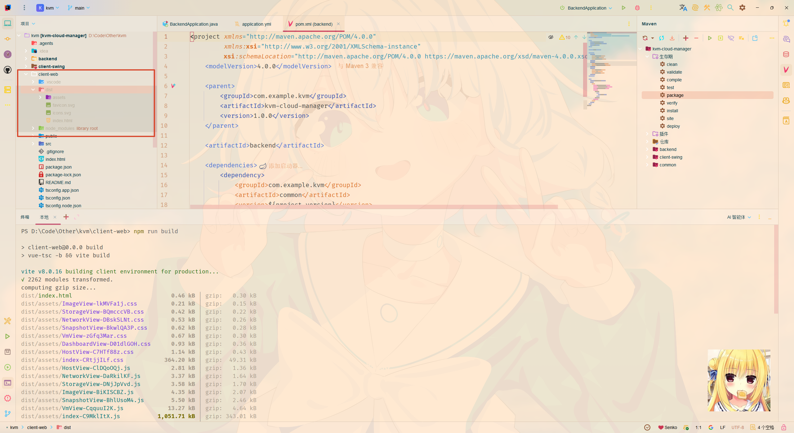

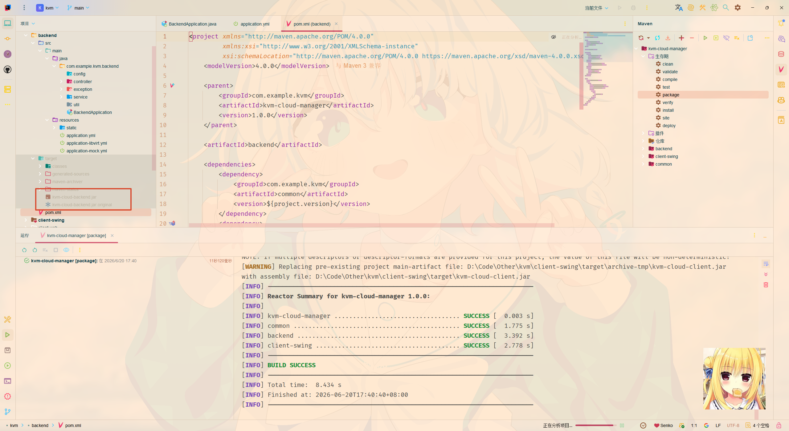

## 5.2 mock 模式测试

　　Windows 开发阶段启动后端：

```bash
java -jar backend/target/kvm-cloud-backend.jar --spring.profiles.active=mock
```

　　Web 前端通过 Vite 代理访问 `/api`。在 mock 模式下，宿主机信息、虚拟机列表、镜像列表、网络列表、快照列表和存储信息均可展示。虚拟机启动、关机、暂停、恢复等操作会修改内存中的状态。

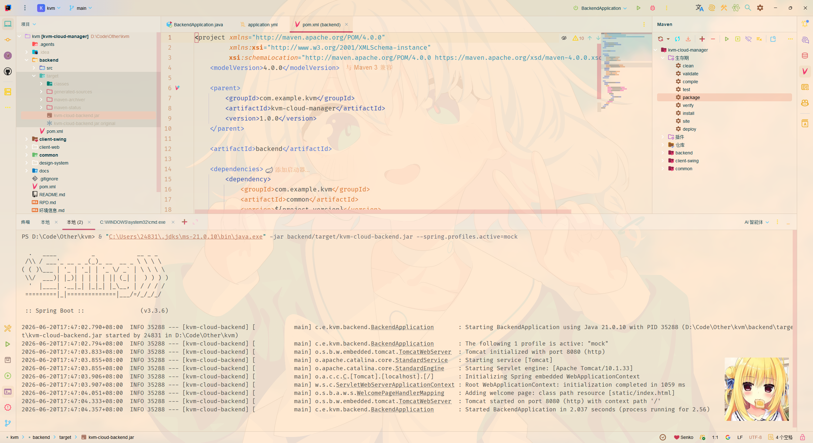

　　运行前端页面的启动代码：
```bash
cd client-web
npm run dev
```


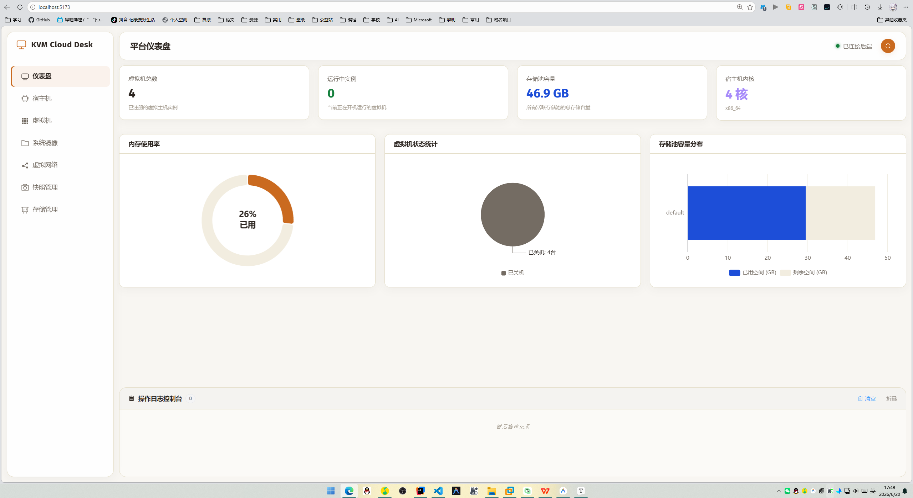

## 5.3 libvirt 模式接口测试

　　CentOS 上启动真实后端：

```bash
java -jar kvm-cloud-backend.jar \
  --spring.profiles.active=libvirt \
  --server.address=0.0.0.0 \
  --server.port=8080
```

　　宿主机信息接口测试：

```bash
curl -s http://192.168.61.130:8080/api/host/info
```

　　接口可返回主机名、CPU、内存、libvirt 版本、QEMU 版本和连接 URI。

　　存储卷接口测试：

```bash
curl -s http://192.168.61.130:8080/api/storage/pools/default/volumes
```

　　接口可返回存储卷名称、路径、类型、容量和已分配空间。

　　网络接口测试：

```bash
curl -s http://192.168.61.130:8080/api/networks
```

　　接口可返回 `default` 网络的状态、网桥、转发模式和 DHCP 范围。

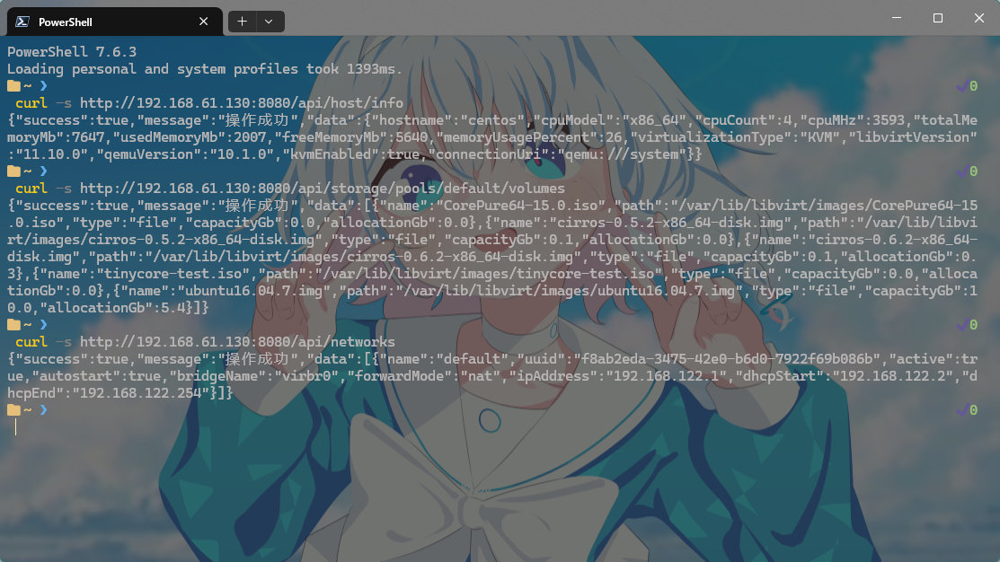

## 5.4 虚拟机生命周期测试

　　对虚拟机执行启动、暂停、恢复、关机和强制关闭操作。测试中，启动、暂停、恢复和强制关闭均能改变虚拟机状态。

　　正常关机依赖虚拟机内部系统响应 ACPI 信号。部分轻量虚拟机没有相关服务，可能不会在指定时间内关机。前端在超时后提示用户执行强制关闭。强制关闭通过调用 `virDomainDestroy` 释放虚拟机运行资源。

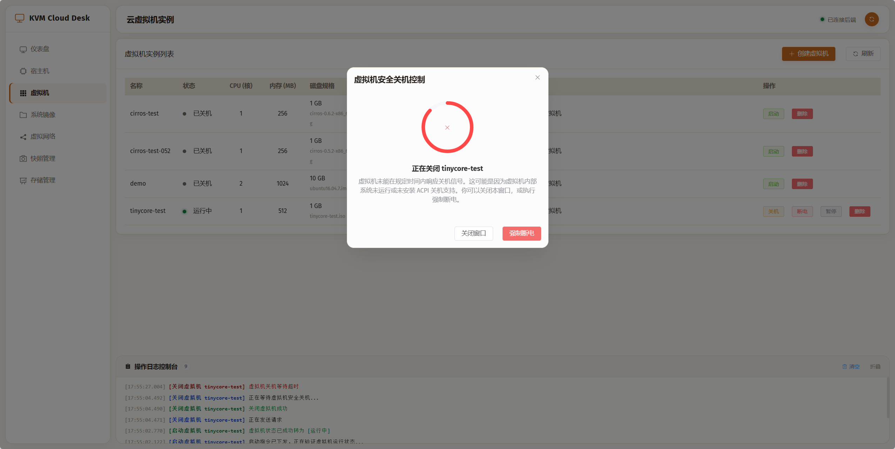

## 5.5 快照测试

　　虚拟机 `demo` 使用 raw 磁盘格式。由于底层存储限制，不支持创建快照，调用相关接口将返回格式不支持的错误。

　　在配置了 qcow2 磁盘格式的测试虚拟机上，快照的创建、查询、恢复与删除操作均已通过接口调用验证，表明后端快照功能已成功接入 libvirt，其实际可用性受磁盘格式限制。

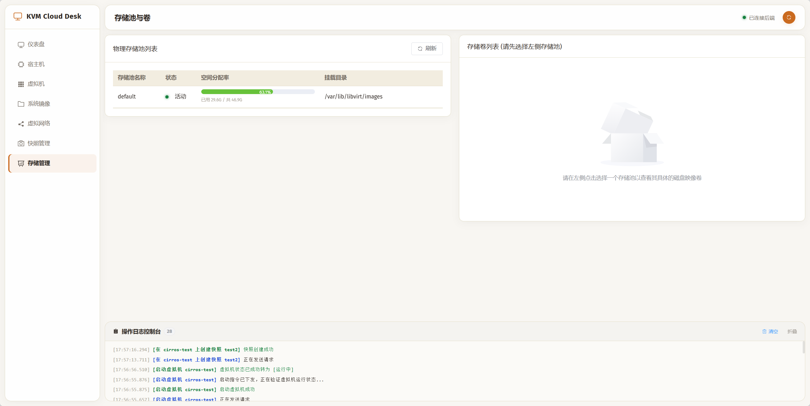

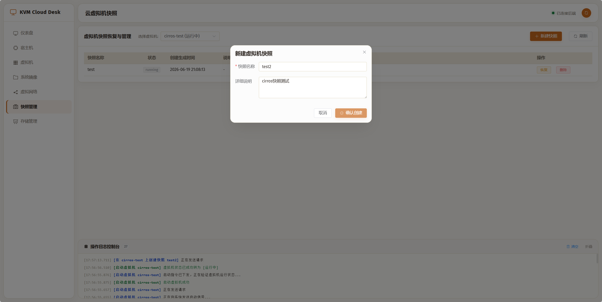

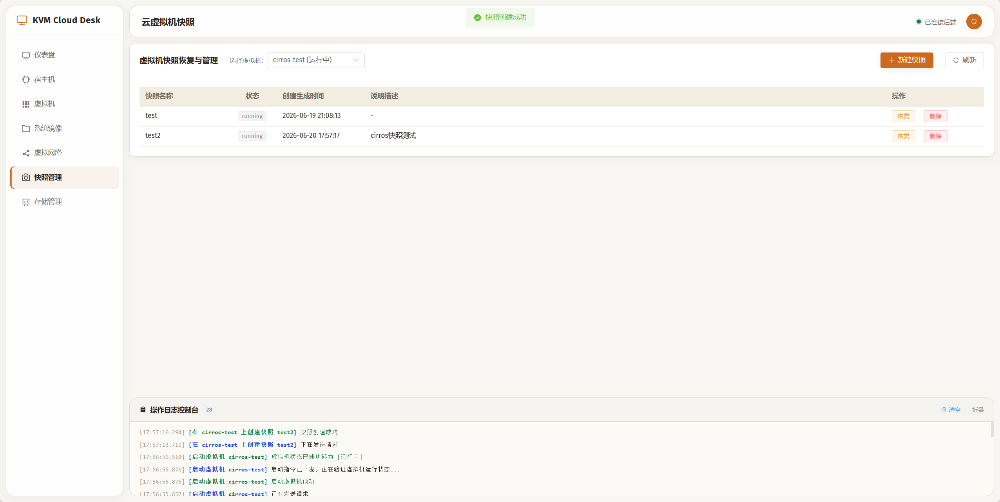

---

# 6 小组分工

　　本课程设计由小组协作完成，分工如下：

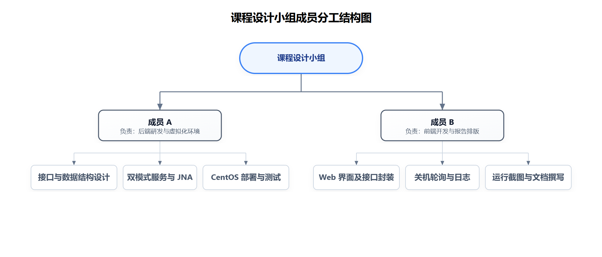

图6-1 课程设计小组成员分工图

　　小组成员的具体开发职责与任务分工如下：

1. **成员 A（后端核心开发负责人）**：
   - **架构搭建与接口开发**：负责基于 Spring Boot 3.3.6 与 Java 21 搭建整个系统的后端 REST 接口，设计统一的响应结构及全局异常拦截机制。
   - **底层映射与内存管理**：手动映射 57 个 libvirt 原生 C 接口和 4 个核心结构体，通过 JNA 访问底层物理动态库；设计显式释放堆外内存指针的防内存泄漏方案。
   - **双环境隔离设计**：利用 Spring 的条件装配机制，编写 mock 与 libvirt 双 Profile 服务层实现类，保障在 Windows 本地开发时能正常返回假数据调优，在 CentOS 下则直接对接真实的 KVM 平台。
   - **虚拟机生命周期业务逻辑**：编写虚拟机启动、关闭、强制断电、暂停与恢复等核心操作的业务逻辑层代码，保障状态流转契约的正确执行。
   - **时序逻辑与状态控制**：设计虚拟机安全关机状态的 1.5 秒异步状态轮询与控制逻辑，实现了当 ACPI 关机信号超时后自愈降级到“强制断电”的操作处理。

2. **成员 B（Web前端开发负责人）**：
   - **网页端构建与页面开发**：负责 client-web 模块的页面搭建，基于 Vue 3、TypeScript 与 Element Plus 设计响应式的管理视图（包括宿主机、虚拟机、存储池、网络等看板）。
   - **控制台看板与日志追踪**：在前端中集成 ECharts 数据可视化图表，展示物理机的实时资源负载；结合 Axios 拦截器与 Pinia 状态管理，通过 X-Action-Description 请求头追踪用户的操作轨迹。

3. **成员 C（部署测试与文档编写负责人）**：
   - **部署调试与问题排查**：完成项目在 CentOS 虚拟机环境的打包部署，配置开发阶段的 Vite 反向代理，排查并解决了由本地 QEMU 旧版程序冲突、DNS 域名反解超时引起的服务连接延迟。
   - **联调测试与文档编写**：负责前端与后端的联合功能调试，编写各模块资源调测用例，主导完成了课程设计报告的文案撰写，并绘制了系统用例图、生命周期图和时序图等关键文档和图表。

　　分工明确划分了后端核心开发、前端 Web 交互以及系统部署、测试与文档编写的三轨并行职责，在保障后端业务逻辑强内聚的同时，亦保证了前端状态管理、环境部署以及测试文档的独立与协同进行。

　　课程设计实施进度如下：

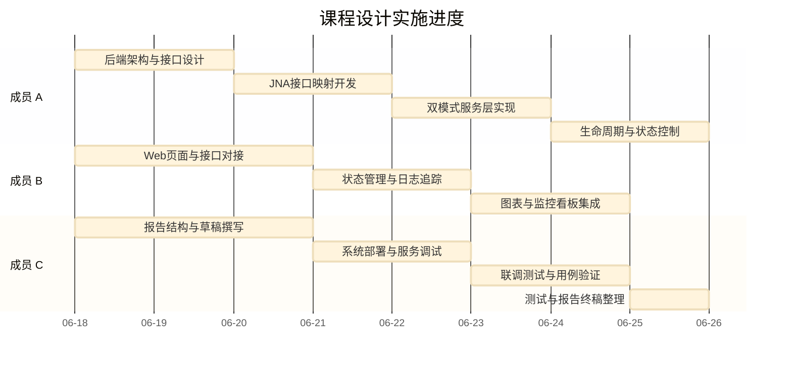
```mermaid
%%{init: {"theme": "base"}}%%
gantt
    title 课程设计实施进度
    dateFormat  YYYY-MM-DD
    axisFormat  %m-%d

    section 成员 A
    后端架构与接口设计   :a1, 2026-06-18, 2d
    JNA接口映射开发      :a2, after a1, 2d
    双模式服务层实现    :a3, after a2, 2d
    生命周期与状态控制   :a4, after a3, 2d

    section 成员 B
    Web页面与接口对接   :b1, 2026-06-18, 3d
    状态管理与日志追踪   :b2, after b1, 2d
    图表与监控看板集成   :b3, after b2, 2d

    section 成员 C
    报告结构与草稿撰写   :c1, 2026-06-18, 3d
    系统部署与服务调试   :c2, after c1, 2d
    联调测试与用例验证   :c3, after c2, 2d
    测试与报告终稿整理   :c4, after c3, 1d
```

图6-2 课程设计实施进度甘特图

　　实施进度甘特图刻画了小组成员开发任务的里程碑节点。通过紧凑的开发排期与联调交汇点，项目得以按时保质完成。

---

# 7 部署中遇到的问题

## 7.1 主机名解析导致启动延迟

　　测试中发现，虚拟机启动接口存在延迟。排查后发现，系统主机名为 `centos`，但 `/etc/hosts` 中没有本地解析记录。libvirt 调用主机名相关接口时会等待 DNS 查询，导致接口响应延迟。

　　处理方式是在 `/etc/hosts` 中加入：

```text
127.0.0.1 centos
::1 centos
```

　　修改后，主机名解析不再依赖外部 DNS，接口响应时间降低。

## 7.2 旧版 QEMU 程序影响版本检测

　　后端调用 `virConnectGetVersion` 时曾返回失败，页面显示 QEMU 版本未知。检查日志后发现，系统中存在旧版 `/usr/local/bin/qemu-system-x86_64`。libvirt 能力检测时扫描到该程序，影响了版本判断。

　　处理方式是屏蔽旧程序，并重启 `virtqemud`：

```bash
mv /usr/local/bin/qemu-system-x86_64 /usr/local/bin/qemu-system-x86_64.bak
systemctl restart virtqemud
```

　　处理后，后端可以正确显示 QEMU 10.1.0。

---

# 8 总结

　　本系统实现了一个基于 KVM 和 libvirt 的云平台管理系统。后端通过 Spring Profile 支持 mock 模式和 libvirt 模式。模拟配置用于 Windows 环境下的开发调试，libvirt 配置用于 CentOS 环境的部署运行。前端通过 HTTP 调用后端接口，避免直接依赖虚拟化底层库。

　　通过本次课程设计，设计并实现了虚拟机生命周期管理、宿主机监控、网络、存储及快照等功能。测试结果表明，系统能够在模拟环境下运行，并可在 CentOS 环境中管理真实 KVM 虚拟机。后续可以继续完善权限管理、批量操作和更细粒度的资源监控。