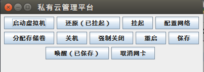

南 阳 理 工 学 院

《KVM虚拟化实践与编程课程设计》报告

# 云平台管理系统

|      |      |      |
|------|------|------|
| 姓名 | 学号 | 成绩 |
|      |      |      |
|      |      |      |
|      |      |      |

> 专业： 软件工程
>
> 班级： 24云计算1班
>
> 指导教师： 单平平

南阳理工学院计算机与软件学院

2026年06月

# 1虚拟化环境的搭建（黑体小三号）

## 课题研究的背景（黑体四号）

容器与虚拟机是两种虚拟化方式，在实际应用中各有优劣。本课题目标在于设计一个管理系统，以提高虚拟化技术的使用效率。Docker是目前流行的轻量级虚拟化容器平台，与传统的虚拟机相比，Docker容器具有诸多优势，如启停速度快、占用资源少、方便的镜像构造和轻简的部署和管理等\[1\]。

正文：宋体小四号，首行缩进两字符

段落：多倍行距1.25，

图：图格式要标准，居中，图的下方有图号和图名

图1 私有云管理平台界面

代码：程序代码符合要求，如下所示：

> public void actionPerformed(ActionEvent e) {
>
>  // TODO Auto-generated method stub
>
>  try {
>
>  demo.shutdown();//关闭虚拟机
>
>  } catch (LibvirtException e1) {
>
>  // TODO Auto-generated catch block
>
>  e1.printStackTrace();
>
>  }
